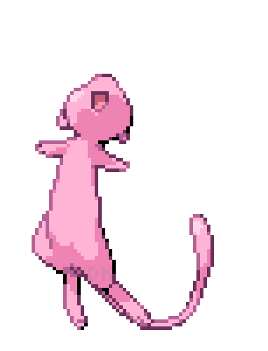

 # 💻 Tech Stack: 

 

  
# 📊 GitHub Stats:

         
  
# 🔝 Top Contributed Repo

<!---
crypticsaiyan/crypticsaiyan is a ✨ special ✨ repository because its `README.md` (this file) appears on your GitHub profile.
You can click the Preview link to take a look at your changes.
--->
